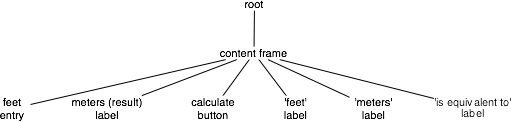

# Widgets
Tk提供了一系列 widget class.

## Widget Hierarchy
In our tk_sample example, we created a single *Frame* as a child of the root window, and that Frame had all the other controls as children.  
The root window was a container for the Frame and was, therefore, the **Frame's parent**. The complete hierarchy for the example looked like this:  
  

## Creating Widgets
构造 widget class 的实例对象，即创建了对应的 widget. 当创建 widget 时，必须指定其 parent widget. 不过，一个**Tk窗口**是顶层widget, 顶层widget没有parent.  
```python
from tkinter import *
from tkinter import ttk

root = Tk()
f = ttk.Frame(root)  # the at least argument is parent widget
b = ttk.Button(f)
```
Whether or not you save the widget object in a variable is entirely up to you, depending on whether you'll need to refer to it later.  
Because the object is inserted into the widget hierarchy, it won't be garbage collected even if you don't keep your own reference to it.  

> If you sneak a peek at how Tcl manages widgets, you'll see each widget has a **specific pathname**;  
> you'll also see this pathname referred to in Tk reference documentation.  
> Tkinter chooses and manages all these pathname for you behind the scenes, so you should never have to worry about them.  
> If you do, you can get the pathname from a widget by calling str(widget).  

## Configuration Options
All widgets have several configuration options that control how the widget is displayed or how it behaves.  
The available options for a widget depend upon the widget class.  
There is a lot of consistency between different widget classes, so options that do similar things tend to be named the same.  
For example, both a button and a label have a `text` option to adjust the text that the widget displays, while a scrollbar would not have a `text` option since it's not needed.  
Similarly, the button has a `command` option telling it what to do when pushed, while a label, which holds just static text, does not.

Configuration options can be set when the widget is first created by specifying their names and values as optional parameters.  
Later, you can retrieve(取得) the current values of those options, and with a tiny number of exceptions(除了极少数例外), change them at any time.  
```python
from tkinter import *
from tkinter import ttk

root = Tk()
f = ttk.Frame(root)

b = ttk.Button(f, text="Hello", command="buttonPressed")

# 获取 text option 的值
print(b['text'])  # Hello

# 修改 text option 的值
b['text'] = 'World'
# 另外一种方式修改 text option 的值
b.configure(text='World')
print(b['text'])  # World

# 获取 text option 的详细描述
print(b.configure('text'))  # ('text', 'text', 'Text', '', 'World')

# 获取 all option 的详细信息, (option's name, option's name in the database, class, default value, current value)
print(b.configure())
'''
{'command': ('command', 'command', 'Command', '', 'buttonPressed'), 

'default': ('default', 'default', 'Default', <index object: 'normal'>, <index object: 'normal'>), 

'takefocus': ('takefocus', 'takeFocus', 'TakeFocus', 'ttk::takefocus', 'ttk::takefocus'), 

'text': ('text', 'text', 'Text', '', 'World'), 

'textvariable': ('textvariable', 'textVariable', 'Variable', '', ''), 

'underline': ('underline', 'underline', 'Underline', -1, -1), 

'width': ('width', 'width', 'Width', '', ''), 

'image': ('image', 'image', 'Image', '', ''), 

'compound': ('compound', 'compound', 'Compound', 

<index object: 'none'>, <index object: 'none'>), 

'padding': ('padding', 'padding', 'Pad', '', ''), 

'state': ('state', 'state', 'State', <index object: 'normal'>, <index object: 'normal'>), 

'cursor': ('cursor', 'cursor', 'Cursor', '', ''), 

'style': ('style', 'style', 'Style', '', ''), 'class': ('class', '', '', '', '')}
'''

```

## Widget Introspection(内省)
Tk exposes a treasure trove of information about each and every widget that your application can take advantage of.  
Much of it is available via the winfo facility; see the winfo command reference for full details.  

The following are some of the most useful methods:  
- *winfo_class*: a class identifying the type of widget, e.g., TButton for a themed button
- *winfo_children*: a list of widgets that are the direct children of a widget in the hierarchy
- *winfo_parent*: parent of the widget in the hierarchy
- *winfo_toplevel*: the toplevel window containing this widget
- *winfo_width*, *winfo_height*: current width and height of the widget; **not accurate until it appears onscreen**
- *winfo_reqwidth*, *winfo_reqheight*: the width and height that the widget requests of the geometry manager (more on this shortly)
- *winfo_x*, *winfo_y*: the position of the top-left corner of the widget relative to its parent
- *winfo_rootx*, *winfo_rooty*: the position of the top-left corner of the widget relative to the entire screen
- *winfo_vieweable*: whether the widget is displayed or hidden (all its ancestors in the hierarchy must be viewable for it to be viewable)


